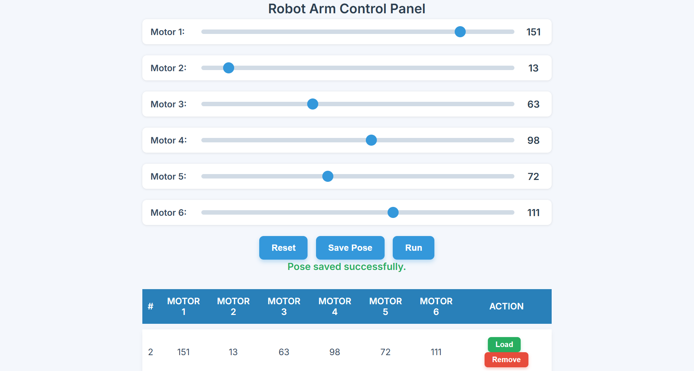
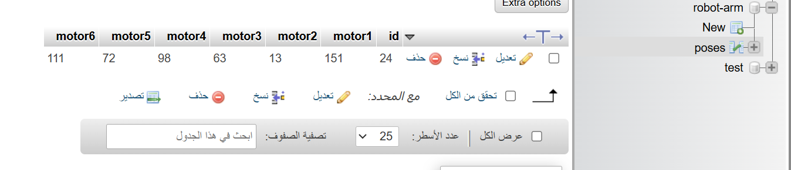

# Robot Arm Control Project

A web interface that allows you to control 6 servo motors using sliders, record poses, and play them.

##  Features

- Real-time control of 6 motors through a simple interface.
- Ability to save and display multiple poses.
- Run button to execute saved movements.
- Clean and user-friendly layout.

##  Project Contents

- [index.html](index.html) HTML + CSS + JavaScript interface.
- [save_pose.php](./save_pose.php) PHP code for storing data in the database.
- [poses.sql](./poses.sql) SQL file containing the table structure.

## Setup Instructions

1. Make sure **XAMPP** or any PHP/MySQL environment is running.
2. Copy the project folder into `htdocs`.
3. Open the following link in your browser: http://localhost/your_project_folder/
4.  Import the `robot-arm.sql` database file using phpMyAdmin.
5. Open the project in your browser and start controlling the robot arm.

##  Project Screenshots

## Notes
- Tested locally using XAMPP.
